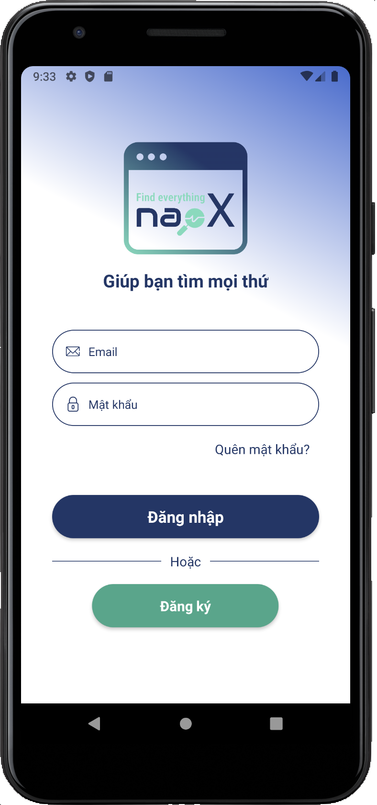
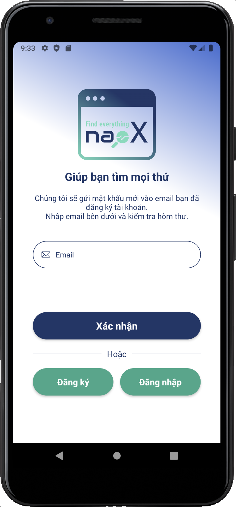
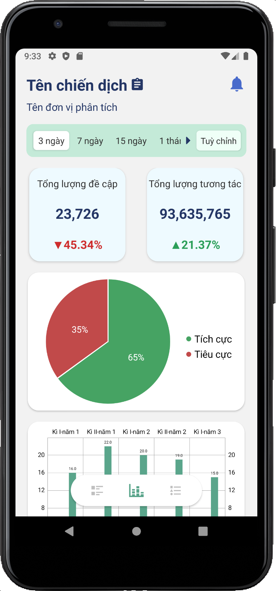

# naoX

Open source products of naoX group participated in the Developer Circles Vietnam Innovation Challenge with the theme of FSI & EPU company

## Features 
This is a social listening product, used with social networks and e-commerce sites and ... hmmm it's not finished, and that's all. You can imagine it

## Libraries 
* [React Navigation](https://reactnavigation.org/)
* [Lottie for React Native, iOS, and Android](https://github.com/lottie-react-native/lottie-react-native)
* [React Native Animatable](https://github.com/oblador/react-native-animatable)
* [React Native Charts Wrapper](https://github.com/wuxudong/react-native-charts-wrapper)
* [FastImage](https://github.com/DylanVann/react-native-fast-image)
* [React Native Linear Gradient](https://github.com/react-native-linear-gradient/react-native-linear-gradient)
* [React Native Size Matters](https://github.com/nirsky/react-native-size-matters)
* [React Native Step Indicator](https://github.com/24ark/react-native-step-indicator)
* [React Native Swiper](https://github.com/leecade/react-native-swiper)
* [React Native Vector Icons](https://github.com/oblador/react-native-vector-icons)
* [React Native Snap Carousel](https://github.com/meliorence/react-native-snap-carousel)

## Screen Shot
|  |  |  |
| - | - | - |
|  |  |  |
|  |  |  |

## Support
* Android
* IOS

## Development team
* naoX team

## Development purpose
Competition - Developer Circles Vietnam Innovation Challenge
